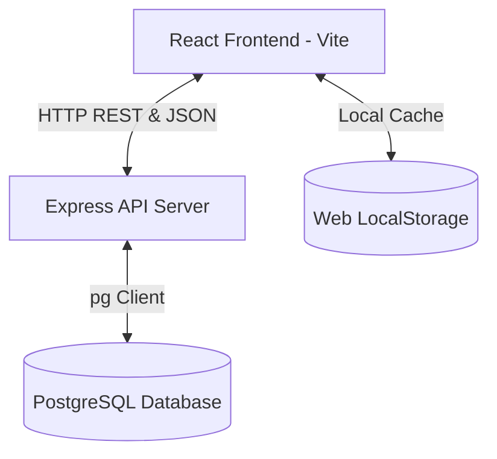

# CampusFlow ERP

CampusFlow ERP is a modern, high-fidelity Enterprise Resource Planning (ERP) platform designed for academic institutions. Built using a high-performance **React + Vite** frontend, a **Node.js + Express** REST API, and a robust **PostgreSQL** database, it provides institutional management, automated timetable scheduling, anti-cheat exam seating allocation, attendance tracking, and official document generation.

---

## 🌟 Visual Identity & User Experience

CampusFlow ERP features a premium user interface with:
*   **Rich Design Aesthetics**: Curated color palettes with a slate-blue and teal tone, subtle glassmorphism card layouts, and clean typographic scaling using modern fonts.
*   **Dynamic Animations & Micro-interactions**: Smooth page transitions, hover-responsive elements, animated status indicator rings, loading spinners, and interactive dashboards.
*   **Responsive Sidebar Navigation**: A toggleable collapsible navigation menu featuring custom-styled active page indicators and quick links.
*   **Real-time Notifications**: A global notification center alert-tray tracking system events such as document creations, seat plans, and attendance postings.

---

## 🛠️ Technology Stack & Architecture



### 1. Frontend
*   **Core**: React 18, React Router DOM (v6) for seamless client routing.
*   **Styling**: Custom CSS styling with HSL variables supporting layout dimensions, badges, toast structures, table configurations, and modal overrides.
*   **Visualization**: Dynamic, interactive charts powered by **Recharts** (Area, Line, Bar, and Pie charts).
*   **Icons**: Rendered via **Lucide React**.

### 2. Backend
*   **Framework**: Node.js & Express.
*   **Security & Enablement**: CORS enabled, dotenv for environment isolation, and parsing limits adjusted to `15MB` for base64 branding logo inputs.

### 3. Database & Synchronization Architecture
Instead of relying on local browser storage or heavy ORMs, the application state is maintained inside a single row of a PostgreSQL table:
*   **State Structure**: Stored inside the `app_state` table containing a `data` `JSONB` column.
*   **Synchronization**: The React frontend uses a custom React Context (`DataContext.jsx`) that fetches the remote state on startup, saves a copy locally in browser `localStorage` as a fallback, and performs incremental `PATCH` operations to PostgreSQL on every action.
*   **Offline Mode**: If the backend API goes offline, the app displays a warning toast, reads/writes to the local cached state in `localStorage`, and queues syncing, ensuring a resilient user experience.

---

## 🔑 User Authentication & Default Roles

CampusFlow ERP supports secure institutional accounts with distinct roles. For ease of testing, the system is seeded with the following default accounts (password for all default accounts is `Admin@123`):

| Role | Email Address | Dept Scope | Permissions |
| :--- | :--- | :--- | :--- |
| **Super Admin** | `admin@campusflow.edu` | All | Master access to settings, wizard, backups, audits, and all CRUD screens. |
| **Principal** | `principal@campusflow.edu` | All | Institutional overview, report exports, and custom letter signatory access. |
| **Head of Department (HOD)** | `hod@campusflow.edu` | CSE | Departmental management, student approvals, and syllabus controls. |
| **Faculty Member** | `faculty@campusflow.edu` | CSE | Marking attendance, viewing schedules, and checking workloads. |
| **Exam Cell Officer** | `exam@campusflow.edu` | Exam | Generating exam timetables, seat allocations, and printing hall tickets. |
| **Student** | `student@campusflow.edu` | CSE | Viewing individual timetables, attendance status, and downloading documents. |

*Note: New users can also register via the Signup form on the login screen.*

---

## 📦 Core Modules & Features

### 1. Onboarding & Setup Wizard
*   Activated automatically on first launch if `setupDone` is false.
*   Guides administrators through a 6-step setup:
    1. **Welcome Introduction**: System capabilities tour.
    2. **Branding Setup**: Uploading a college logo (under 2MB) and entering institutional name/affiliation.
    3. **Institutional Details**: Autonomous status, established year, AISHE code, NAAC grade, and motto.
    4. **Academic Departments**: Initial registration of active departments.
    5. **Classrooms Config**: Configuring initial lecture halls, computer labs, and seminar halls.
    6. **Preview & Deploy**: Live rendering check of the branding layout before writing the initial state.

### 2. Smart Timetable Scheduling Engine
*   **Scheduling Algorithm**: Avoids scheduling conflicts by evaluating constraints:
    *   No double-booking for classrooms.
    *   No double-booking for faculty members.
    *   Maintains weekly hour constraints for subjects.
*   **Scheduling Tools**:
    *   *Lock/Unlock*: Prevent specific slots from being modified by automatic generations.
    *   *Clear Slots*: Quickly flush individual hours or clean all unlocked slots.
*   **Multi-View Layout**: Filter timetables by Admin View, Student View, Faculty View, or Classroom View.

### 3. Exam Seating & Anti-Cheat Grid Planner
*   **Anti-Cheat Algorithm**: Mixes students from different departments based on a seating matrix. No two adjacent seats will host students from the same department, reducing chances of malpractice.
*   **Interactive Seat Grid**: Displays an 8×10 visual map of the exam hall, color-coded by department. Seats show student roll numbers and highlight absences.
*   **Statistics Panel**: Tracks metrics like total halls used, seats filled, departments mixed, and adjacency violations.

### 4. Attendance & Defaulter System
*   **Daily Attendance Ledger**: Faculty can mark session-wise attendance by selecting Department, Subject, Section, Date, and Slot.
*   **Batch Operations**: Quick buttons for "Mark All Present" or "Mark All Absent".
*   **Defaulter Analyzer**: Highlights students falling below the mandatory **75%** attendance threshold, with warning status badges.
*   **Visual Reports**: Visualizes attendance history and subject-wise averages via Recharts.

### 5. High-Fidelity Document & Report Generator
Produces official, printable documents in **PDF** (via `jsPDF` + `jspdf-autotable`) and **DOCX** (via `docx` package) formats:
*   **Branded Header**: Embedded logo, contact information, NAAC grades, autonomous status, and university affiliation.
*   **Deterministic QR Verification**: Generates a custom MurmurHash3-derived QR-style canvas stamp embedded directly in the document. This QR stamp is a unique, visual authenticity mark generated deterministically from the document's content.
*   **Document Types**:
    1. **Fee Receipt**: Generates itemized billing breakdowns (Tuition, Lab, Library, Exam fees) with payment modes (Cash, UPI, Cards, Bank Transfer) and transactional IDs.
    2. **Hall Ticket**: Individual student admit cards with exam dates, subjects, allocated room codes, and QR verification codes.
    3. **Attendance Summary**: Official subject-wise student attendance registers.
    4. **Official Letter**: Custom letter generator complete with signature designations (Principal, HOD) and margin margins.
    5. **Timetable / Seating Chart**: Exportable timetables and seat maps for offline printouts.

### 6. Security, Backups & Compliance Auditing
*   **Security Configuration**: Manage authentication settings, JWT parameters, HTTPS enforcements, and password hash costs.
*   **JSON Backup System**: Export the entire database state to a local JSON file, or restore the system by uploading an existing backup file.
*   **Compliance Auditing**: A system-wide audit page logging every write operation:
    *   **Fields**: Timestamp, Operator, Action Type (CREATE, UPDATE, DELETE, GENERATE, SUBMIT), Source Module, Target Entity, and simulated IP Address.

---

## 🚀 Local Setup & Installation

### Requirements
*   **Node.js 20+**
*   **Docker Desktop** (or a local PostgreSQL server)

### Step-by-Step Setup

1.  **Clone & Install Dependencies**:
    ```bash
    npm install
    ```

2.  **Environment Setup**:
    Copy the environment template:
    ```bash
    copy .env.example .env
    ```
    *Ensure the environment variables match your local setup. Default ports are `5173` for frontend and `4000` for API.*

3.  **Spin up PostgreSQL DB via Docker**:
    ```bash
    npm run db:up
    ```
    *This starts a local PostgreSQL instance inside Docker. The container is configured with username: `campusflow`, password: `campusflow`, and database: `campusflow_erp` on port `5432`.*

4.  **Launch Concurrent Development Servers**:
    ```bash
    npm run dev
    ```
    *This runs the Express API server (on port `4000`) and the Vite React development server (on port `5173`) concurrently.*

---

## 📡 API Reference

The backend API automatically initializes the database tables and schemas on startup.

| Method | Endpoint | Description | Request Body |
| :--- | :--- | :--- | :--- |
| **GET** | `/api/health` | Checks backend server status and verifies active PostgreSQL database connection. | N/A |
| **GET** | `/api/state` | Returns the entire current system state JSON document. | N/A |
| **PATCH** | `/api/state` | Marginally patches the JSONB data column. | Partial state JSON object |
| **POST** | `/api/reset` | Clears all custom changes and resets the system state to empty template state. | N/A |

Useful testing commands:
```bash
# Health check
curl http://localhost:4000/api/health

# State fetch
curl http://localhost:4000/api/state
```
